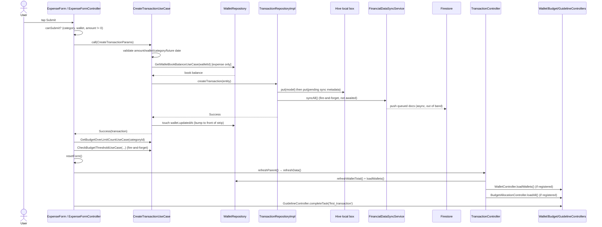

# Transaction Tab — Current Data Flow

Traced from `modules/domain_features/lib/features/transaction/**` and
`modules/domain_features/lib/features/liability/**` (the tab bar hosts Expense,
Income, Investment, Liability/Borrow-Repay, and Lend/Lend-Collect).

## 1. Structural data flow

```mermaid
flowchart TD
    User(("User opens\nTransaction tab")) --> TxPage["TransactionPage"]
    TxPage --> TxCtrl[["TransactionController\n(GetX singleton)"]]
    TxCtrl -->|"visibleTabs / isTabUnlocked"| TabBar["TransactionTabBar"]
    TxCtrl --> TabView["TransactionTabBarView"]
    TabBar -->|"setTabIndex"| TxCtrl

    TxCtrl -->|"loadWallets()"| WalletRepo[("WalletRepository")]
    TxCtrl -->|"refreshWalletTotal()"| WalletBalUC["GetWalletBalancesUseCase"]
    WalletBalUC --> WalletRepo

    subgraph Base["Shared abstract base"]
        FormBase[["TransactionFormController"]]
        QuickEntry[["QuickEntryMixin\n(AI Smart Entry)"]]
    end
    TxCtrl -.->|"RxList&lt;WalletEntity&gt; wallets\n(ever() listener, duplicated per tab)"| FormBase

    TabView --> ExpenseForm["ExpenseForm"]
    TabView --> IncomeForm["IncomeForm"]
    TabView --> InvestForm["InvestmentForm"]
    TabView --> LiabForm["LiabilityForm\n(Borrow / Repay)"]
    TabView --> LendForm["LendForm\n(Lend / Collect)"]

    ExpenseForm --> ExpenseCtrl["ExpenseFormController"]
    IncomeForm --> IncomeCtrl["IncomeFormController"]
    InvestForm --> InvestCtrl["InvestmentFormController"]
    LiabForm --> LiabCtrl["LiabilityFormController"]
    LendForm --> LendCtrl["LendFormController"]

    ExpenseCtrl -.->|"extends"| FormBase
    IncomeCtrl -.->|"extends"| FormBase
    InvestCtrl -.->|"extends"| FormBase
    LiabCtrl -.->|"extends"| LiabBase[["LiabilityBaseFormController"]]
    LendCtrl -.->|"extends"| LiabBase
    LiabBase -.->|"extends"| FormBase

    ExpenseCtrl -.->|"with"| QuickEntry
    IncomeCtrl -.->|"with"| QuickEntry
    InvestCtrl -.->|"with"| QuickEntry
    LiabBase -.->|"with"| QuickEntry

    CategoryUC["GetCategoriesUseCase"]
    ExpenseCtrl --> CategoryUC
    IncomeCtrl --> CategoryUC
    InvestCtrl --> CategoryUC
    LiabCtrl --> CategoryUC
    LendCtrl --> CategoryUC
    CategoryUC --> CategoryRepo[("CategoryRepository")]

    QuickEntry --> ParseUC["ParseQuickEntryUseCase"]
    ParseUC -->|"on-device parse first"| ParseUC
    ParseUC -->|"consent-gated, daily-capped fallback"| CloudAI[("Cloud AI (Gemini)")]

    ExpenseCtrl -->|"submitForm (new)"| CreateTxUC["CreateTransactionUseCase"]
    IncomeCtrl -->|"submitForm (new)"| CreateTxUC
    ExpenseCtrl -->|"submitForm (isEditing)"| UpdateTxUC["UpdateTransactionUseCase"]
    IncomeCtrl -->|"submitForm (isEditing)"| UpdateTxUC
    CreateTxUC --> TxRepo[("TransactionRepository")]
    UpdateTxUC --> TxRepo
    CreateTxUC -->|"overspend guard"| WalletBookUC["GetWalletBookBalanceUseCase"]
    UpdateTxUC -->|"overspend guard"| WalletBookUC
    WalletBookUC --> WalletRepo

    InvestCtrl -->|"submitForm"| CreateInvestUC["CreateInvestmentTransactionUseCase"]
    CreateInvestUC -->|"resolve / create position wallet"| WalletRepo
    CreateInvestUC -->|"contribute = 2 linked legs\nreturn = 1 leg"| TxRepo

    LiabCtrl -->|"new loan"| CreateLiabUC["CreateLiabilityUseCase"]
    LendCtrl -->|"new loan"| CreateLiabUC
    LiabCtrl -->|"existing loan"| RecordPayUC["RecordLiabilityPaymentUseCase"]
    LendCtrl -->|"existing loan"| RecordPayUC
    CreateLiabUC --> LiabRepo[("LiabilityRepository")]
    CreateLiabUC -->|"init leg"| TxRepo
    RecordPayUC --> LiabRepo
    RecordPayUC -->|"settlement / increment leg"| TxRepo
    RecordPayUC --> OutstandingUC["GetLiabilityOutstandingBalanceUseCase"]
    OutstandingUC --> LiabRepo

    TxRepo --> TxLocal[("Hive\nTransactionLocalDataSource")]
    TxRepo -.->|"fire-and-forget"| SyncSvc[["FinancialDataSyncService.syncAll()"]]
    SyncSvc --> TxSync["TransactionSyncDataSource"]
    TxSync --> Firestore[("Cloud Firestore")]
    LiabRepo --> LiabLocal[("Hive\nLiabilityLocalDataSource")]
    LiabRepo -.->|"fire-and-forget"| SyncSvc

    CreateTxUC -.->|"on success"| ExpensePost{{"Expense-only\npost-submit"}}
    ExpensePost --> BudgetOverUC["GetBudgetOverLimitCountUseCase"]
    ExpensePost --> BudgetThreshUC["CheckBudgetThresholdUseCase"]
    ExpensePost --> GuidelineCtrl["GuidelineController\n.completeTask()"]

    CreateTxUC -.->|"on success"| RefreshParent[["refreshParent()"]]
    UpdateTxUC -.->|"on success"| RefreshParent
    CreateInvestUC -.->|"on success"| RefreshParent
    CreateLiabUC -.->|"on success"| RefreshParent
    RecordPayUC -.->|"on success"| RefreshParent
    CreateLiabUC -.->|"on success"| RemindUC["ScheduleLiabilityRemindersUseCase"]
    CreateInvestUC -.->|"on success"| GuidelineCtrl
    CreateLiabUC -.->|"on success"| GuidelineCtrl

    RefreshParent --> TxCtrl
    RefreshParent -->|"Get.find if registered"| WalletCtrl["WalletController.loadWallets()"]
    RefreshParent -->|"Get.find if registered"| BudgetAllocCtrl["BudgetAllocationController.loadAll()"]

    ReportPage["Report page\n(transaction tile)"] --> EditSheet["EditTransactionSheet"]
    EditSheet -->|"Get.put(tag: edit)\nseparate instance"| ExpenseCtrlEdit["ExpenseFormController (tag)"]
    EditSheet -->|"Get.put(tag: edit)\nseparate instance"| IncomeCtrlEdit["IncomeFormController (tag)"]
    EditSheet -->|"loadForEdit(transaction)"| ExpenseCtrlEdit
    EditSheet -->|"loadForEdit(transaction)"| IncomeCtrlEdit
    ExpenseCtrlEdit -->|"submitForm → isEditing"| UpdateTxUC
    IncomeCtrlEdit -->|"submitForm → isEditing"| UpdateTxUC
```

## 2. Temporal flow — Expense submit (representative of Income/Investment/Liability/Lend)

## 3. Observed issues in the current flow

- **Liability vs Lend controllers are ~95% duplicated code.** `LiabilityFormController` and
  `LendFormController` (`liability/presentation/get_x/`) are near-identical
  ~490-line files — same installment-draft handling, same `submitForm`, same
  `handleKeyPress`/`handleDelete` overrides — differing mainly in `direction`
  and one filter (`isBorrow` vs `isLend`). Any bug fix must be applied twice.
- **Fragile, documented DI ordering hazard.** `TransactionController.onInit()`
  deliberately does *not* register `InvestmentFormController`/
  `LiabilityFormController`/`LendFormController` because doing so recurses into
  `Get.find<TransactionController>()` mid-`onInit()`. They're registered
  instead from `TransactionPage.buildContent()`, one level up — the ordering
  is enforced by convention/comments, not by the type system.
- **Wallet list is re-derived independently per form.** `TransactionController.wallets`
  is the single source, but every `TransactionFormController` subclass keeps
  its own filtered copy (`_liquidOnly`) synced via a separate `ever()` worker —
  5 parallel listeners doing the same filter instead of one shared derived
  stream/selector.
- **Use-case access is inconsistent.** Some controllers take use cases via
  constructor injection (`ExpenseFormController(this._transactionRepository)`,
  `InvestmentFormController(this._getCategories, ...)`), while the same
  controllers *also* reach into the global `getIt<...>()` locator inside
  `submitForm`/loaders for other use cases (`CreateTransactionUseCase`,
  `UpdateTransactionUseCase`, `GetBudgetOverLimitCountUseCase`, ...). No
  consistent boundary between "injected dependency" and "service-located
  dependency."
- **Cross-feature coupling via `Get.find`/`Get.isRegistered` instead of
  contracts.** Post-submit fan-out (`WalletController`,
  `BudgetAllocationController`, `ReportController`, `GuidelineController`,
  `UserLevelController`) is wired by reaching across feature boundaries with
  the GetX service locator and `if (Get.isRegistered<...>())` guards, rather
  than through a domain event / callback the transaction feature owns. This
  is the same pattern flagged in `CLAUDE.md`'s dependency-direction rules —
  it works today but any of those controllers being absent silently no-ops
  the refresh.
- **Sync is unconditionally fire-and-forget per mutation.** `TransactionRepositoryImpl`
  calls `_syncService.syncAll()` (not awaited) after every single create/update/
  delete/soft-delete — no batching, no backoff visible at this layer, and
  callers get "Success" before the transaction has actually left the device.
- **Edit path duplicates the create path's controller.** `EditTransactionSheet`
  spins up a second, `tag`-scoped `ExpenseFormController`/`IncomeFormController`
  instance (separate from the tab's singleton) purely to reuse `submitForm`,
  meaning two live instances of the same controller class exist with
  overlapping responsibility and separate lifecycles.
- **Budget-threshold/over-limit side effects live inside `ExpenseFormController.submitForm`**
  rather than a shared post-create hook — so Income/Investment/Liability forms
  have no equivalent extension point, and adding a similar cross-cutting
  effect to another tab means copy-pasting into that controller's `submitForm`
  too.

These are structural observations from reading the current code, not a
proposed redesign — happy to turn this into a refactor plan (e.g. a shared
`LoanDirection`-parameterized form controller, a single wallet-selector
stream, a `TransactionSubmitted` domain event for fan-out) if useful.
